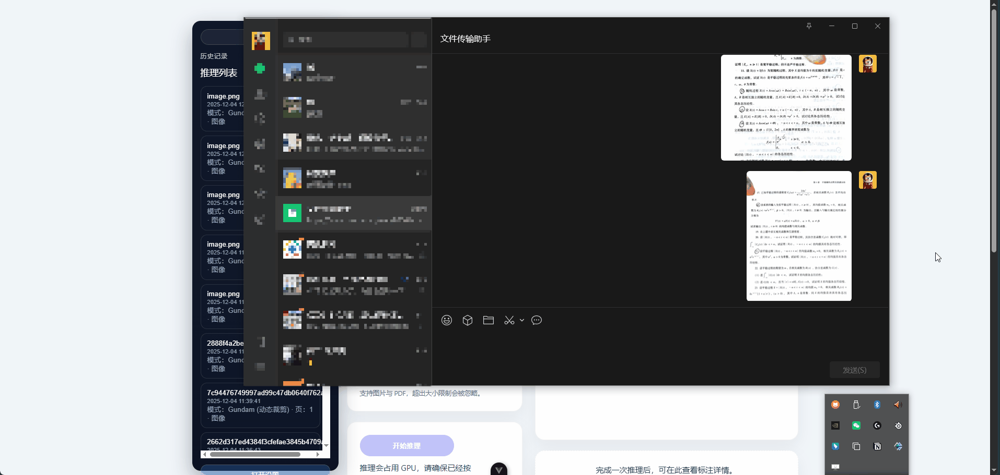

# DeepSeek-OCR Web Playground 🚀🖼️

English | [中文](README_zh.md)

FastAPI + Vite/Vue wrapper around the DeepSeek-OCR model for quick local testing. 🎯

## Showcase:
Showcase: Mathematical Formula Recognition


Showcase: Table Data Processing


## Features ✨
- 📄 PDF & 🖼️ image upload, with automatic PDF page splitting.
- ⏳ Progress visualization during uploads/inference so you know it’s working.
- 🗺️ Bounding-box overlay for layout/annotation visualization.
- 📑 Annotation detail view for extracted labels/regions.
- 📜 History management: View and manage past OCR results.
- 🧩 Modular UI: Specialized components for Upload, Prompt, Mode, and Actions.
- 📊 Enhanced Visualization: Visual preview, layout details, and page text inspection.
- 📝 Logs & Workflow: Real-time logs and workflow step tracking.

Screenshots:
- Overlay view: 
- Annotation details: 

## Tested environment 🧪
- Conda env: `ds-ocr`
- Python 3.10.19 (conda-forge)
- PyTorch 2.6.0+cu118 (CUDA)
- GPU: NVIDIA GeForce RTX 3090

## Quick start (conda) ⚡
```bash
# 1) create / activate
conda create -n ds-ocr python=3.10 -y
conda activate ds-ocr

# 2) backend deps (install torch CUDA build first if needed)
cd web_project/backend
pip install --upgrade pip
# offline / matching CUDA build:
# pip install --no-index --find-links ../../wheels torch torchvision
pip install -r requirements.txt

# 3) frontend deps
cd ../frontend
npm install

# 4) run dev (from repo root)
cd ../../
./start.sh
```
`./start.sh` starts FastAPI on `localhost:8000` and Vite dev server on `localhost:5173`. 🌐

### Run separately 🧭
```bash
# backend
cd web_project/backend
uvicorn app:app --host 0.0.0.0 --port 8000

# frontend
cd web_project/frontend
npm run dev
```

### Key env vars 🛠️
- `OCR_BACKEND_PORT`: backend port (default 8000)
- `DEEPSEEK_OCR_MODEL_PATH`: model weights path override (default `ocr_project/model`)
- `DEEPSEEK_ATTN_IMPL`: attention impl, e.g. `flash_attention_2`
- `DEEPSEEK_ALLOWED_ORIGINS`: CORS allowlist, comma-separated
- `DEEPSEEK_MAX_IMAGE_MB`: upload size limit in MB (default 15)

---
