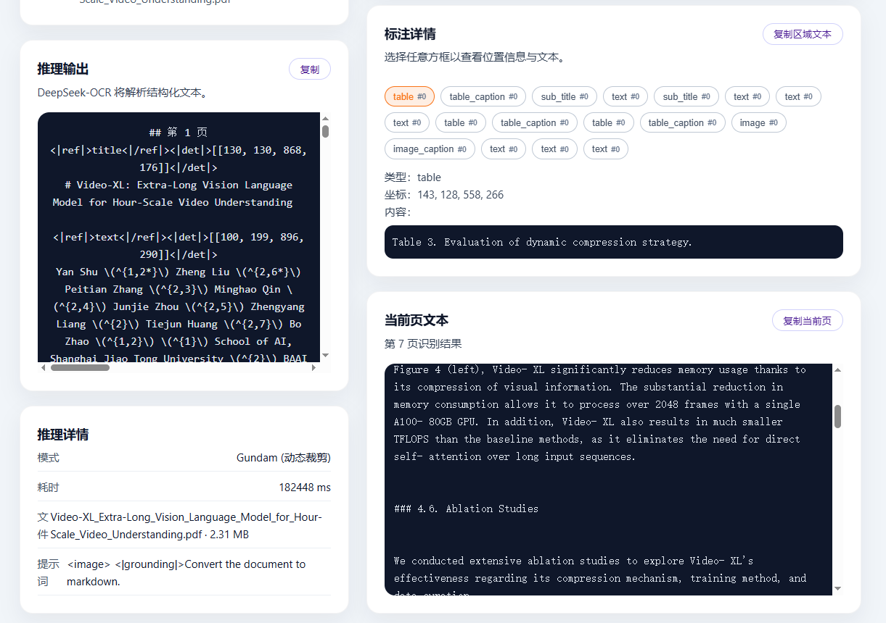

# DeepSeek-OCR 本地演示

[English](README.md) | 中文

FastAPI 后端 + Vite/React 前端的 DeepSeek-OCR 本地演示项目。

## 功能特性 ✨
- 支持 PDF / 图片上传，PDF 自动分页处理。
- ⏳ 进度可视化，上传和推理过程可见。
- 🗺️ 标注/框选可视化（布局框叠加）。
- 📑 标注详情视图，展示识别出的区域和标签。

示例截图：
- 标注叠加：
- 标注详情：

## 参考环境
- Conda 环境：`ds-ocr`
- Python 3.10.19（conda-forge）
- PyTorch 2.6.0+cu118（CUDA）
- GPU：NVIDIA GeForce RTX 3090

## 安装步骤（conda）
```bash
# 1) 创建并启用环境
conda create -n ds-ocr python=3.10 -y
conda activate ds-ocr

# 2) 安装后端依赖（先安装匹配 CUDA 的 torch）
cd web_project/backend
pip install --upgrade pip
# 如果离线或需匹配 CUDA，可用本地 wheel：
# pip install --no-index --find-links ../../wheels torch torchvision
pip install -r requirements.txt

# 3) 安装前端依赖
cd ../frontend
npm install

# 4) 回到仓库根目录启动
cd ../../
./start.sh
```
`./start.sh` 会启动 FastAPI（默认 8000）和 Vite 开发服务器（默认 5173）。

### 分开启动
```bash
# 后端
cd web_project/backend
uvicorn app:app --host 0.0.0.0 --port 8000

# 前端
cd web_project/frontend
npm run dev
```

### 常用环境变量
- `OCR_BACKEND_PORT`：后端端口（默认 8000）
- `DEEPSEEK_OCR_MODEL_PATH`：模型权重路径（默认 `ocr_project/model`）
- `DEEPSEEK_ATTN_IMPL`：注意力实现（默认 `flash_attention_2`）
- `DEEPSEEK_ALLOWED_ORIGINS`：CORS 允许域，逗号分隔
- `DEEPSEEK_MAX_IMAGE_MB`：上传大小限制（默认 15MB）
